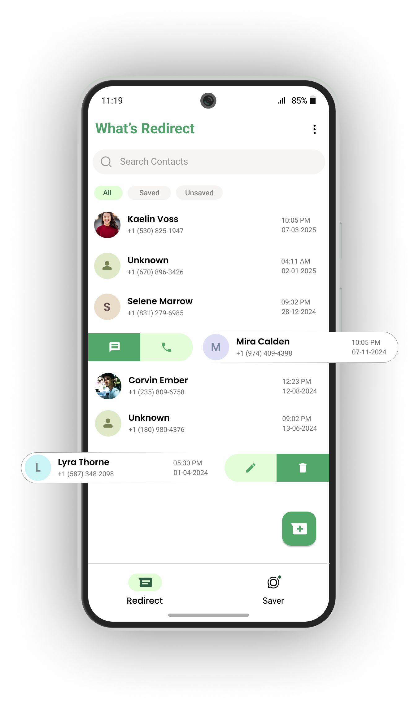

# 🚀 Whats Redirect – WhatsApp Chat Launcher & Status Saver

A sleek and powerful Flutter app designed to enhance your WhatsApp experience. Start chats without saving numbers, manage recent contacts locally, and download viewed statuses — all in a clean, offline-friendly app.

---




---

## 🔗 Support & Quick Links  


[](https://www.buymeacoffee.com/sanketkalae)

[](https://whats-redirect.netlify.app)

---

## 📱 About Our App

**What's Redirect** is a simple and efficient tool that lets you send WhatsApp messages without saving the recipient’s number. Whether you're reaching out to clients, customers, or one-time contacts, What's Redirect helps you connect instantly — just enter the phone number and you're redirected straight to a WhatsApp chat. No more cluttered contacts list. No more unnecessary saves. Just quick, direct messaging.

### • Fully Responsive
Use What's Redirect on any device—mobile, tablet, or desktop. The interface automatically adjusts for the best experience, no matter where you're accessing it from.

### • Retina Ready
Enjoy sharp visuals and clean UI on all high-resolution screens. Every element looks crisp and professional on both modern and older devices.

### • Stylish Design
Designed with simplicity and elegance in mind. What's Redirect delivers a modern look and intuitive user experience for quick access without confusion.

### • Instant WhatsApp Access
Skip the hassle of saving numbers. Just enter a phone number and you're taken directly to a WhatsApp chat. Quick, clean, and efficient messaging.

### • Easy to Use
No complex setup or learning curve. Open the app, type in a number, and start chatting instantly. It’s designed to work for everyone, right out of the box.

### • Free of Charge
Enjoy all the features of What's Redirect without spending a dime. No subscriptions, no ads, no hidden fees—just pure functionality, totally free.

---

## How The App Works?

### •  Open the App
No sign-up or login required. Just open What's Redirect and start using it instantly. No friction, no delays — just straight to the point.

### •  Grant Permission
Allow basic permissions (like storage if needed). This lets the app handle local data securely and give you a smooth, uninterrupted experience.

### •  Add a Number
Tap the Add button to enter any phone number. Instantly choose whether to send a WhatsApp message, make a call, or send an SMS — all without saving the contact.

### • Manage Locally
Every number you enter is saved locally on your device. You can easily edit or delete entries anytime — your data stays private and under your control.

---

## ✨ Features

- Instant WhatsApp chat without saving numbers  
- Local storage of recently used numbers  
- Status saver for images and videos  
- Country code picker for global reach  
- Beautiful UI with shimmer loading  
- Completely offline — privacy first

---

## 🧩 Flutter Packages Used

& url_launcher  
- path_provider  
- sqflite  
- intl  
- flutter_slidable  
- flutter_screenutil  
- get  
- fluttertoast  
- flutter_contacts  
- shimmer  
- device_info_plus  
- permission_handler  
- video_thumbnail  
- share_plus  
- cr_file_saver  
- video_player  
- shared_preferences  
- gal  
- country_code_picker

---

## ⚙️ Installation

```bash
# Clone the project
git clone https://github.com/your-username/whats-redirect.git
cd whats-redirect

# Get dependencies
flutter pub get

# Run the app
flutter run
```

> Make sure a device or emulator with WhatsApp installed is connected.

---

## 📂 Status Saver Flow

The app detects statuses in WhatsApp’s hidden media folder, shows them in a user-friendly gallery, and enables one-tap downloads. Permissions are handled smartly using the appropriate packages.

---

## 💌 Contact

Have feedback or questions?  
📧 Email us at: [sanketkalathiya201@gmail.com](mailto:sanketkalathiya201@gmail.com)

---

## 📜 License

© 2025 Sanket Kalathiya — All rights reserved.  
This project is licensed under the MIT License.

